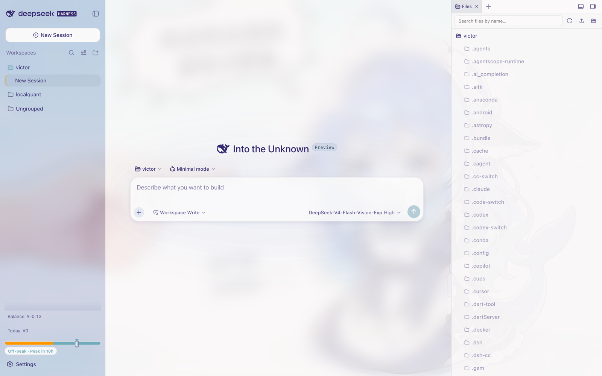

# dsh-theme-whalegirl

DeepSeek-鲸鱼娘主题，面向 [DeepSeek Harness](https://github.com/deepseek-ai/deepseek-harness)（DSH）Web UI——移植自 DreamSkin 皮肤包 [`ver_cb557ececaa5de3f3dbe`](https://dreamskin.cc/themes/ver_cb557ececaa5de3f3dbe)。

[English](README.md) | 中文



## 功能

- **完整令牌重映射** —— 在 DSH 原生主题系统注册一套亮色主题（`deepseek-whalegirl`），携带完整的 `--dsw-*` 令牌字典（174 个）：表面、文字、边框、按钮、代码块、滚动条、状态色的每一档都由 DreamSkin 调色板推导。
- **环境壁纸** —— 鲸鱼娘插画作为固定背景衬在磨砂玻璃界面之后；各表面保留少量透明度让壁纸透出，应用主框附加背景模糊。
- **DreamSkin safe-css 意图移植** —— 圆角磨砂侧边栏、咖啡色输入框聚焦光晕、沙金色选中文本、紫调柔和阴影。
- **原生集成** —— 插件挂载时通过 `theme.setTheme()` 固定主题；内置「外观」设置重置偏好为*跟随系统*时会自动恢复。你在「外观」里显式选择亮/暗色则优先，直到在市场主题页把插件关开一次后恢复。

取自源皮肤的调色板锚点：

| 角色 | 源值 | 用途 |
| --- | --- | --- |
| 文字 text | `#352970` | 主标签、墨色阶梯 |
| 高亮 highlight | `#455b78` | 品牌与主按钮 |
| 强调 accent | `#7a4e29` | 输入框聚焦光圈 |
| 次强调 accentAlt | `#ceb683` | 导航选中描边、选区 |
| 次色 secondary | `#85c1cc` | 蓝/信息色阶梯 |
| 面板 panel / panelAlt | `#abb4cf` / `#c3cee4` | 长春花蓝侧边栏玻璃 |
| 背景 background | `#bd9999` | 玫瑰纸色调、气泡 |

## 安装

从 [dsh-market](https://github.com/dsh-market/dsh-market) 插件的主题 Tab 搜索 "whalegirl"，或在终端：

```sh
# GitHub Release 预构建包（免构建）
dsh plugin --profile web add -w https://github.com/ZHOUcourier/dsh-theme-whalegirl/releases/latest/download/dsh-theme-whalegirl.tgz
```

其他来源：

```sh
# git 仓库
dsh plugin --profile web add -w github:ZHOUcourier/dsh-theme-whalegirl

# npm
dsh plugin --profile web add -w dsh-theme-whalegirl

# 本地目录
dsh plugin --profile web add -w link:/path/to/dsh-theme-whalegirl
```

重启 profile 生效：

```sh
dsh --profile web
```

插件挂载后主题立即应用。想切走：在 设置 → 通用 → 外观 选择偏好即可（插件会让位）；想切回：在市场主题页把插件关闭再开启。

卸载：

```sh
dsh plugin --profile web remove dsh-theme-whalegirl
```

## 兼容性

- 需要 DSH web 客户端 profile（`dsh.client.platform: "web"`，客户端入口经 `exports["./client"]` 暴露）。
- 仅提供亮色外观——忠实还原源皮肤的单套亮色调色板。
- 与其他插件共存；禁用时不触碰任何东西，只依赖受控的 body 属性 `data-dsh-whalegirl`。

## 开发

```sh
npm run build   # 将 src/client.js 包装为 lib/client.js 并内嵌 assets/background.jpg
npm test        # 冒烟测试：对 mock DOM 走一遍 register/guard/dispose
npm run check   # 校验 lib/ 与 src/ 一致（CI 用）
```

构建零依赖（纯 Node）。`lib/` 已提交入库，安装方无需执行任何构建。

## 致谢

- 主题插画与配色：[DeepSeek-鲸鱼娘](https://dreamskin.cc/themes/ver_cb557ececaa5de3f3dbe)（[DreamSkin](https://dreamskin.cc)）。
- 插件结构遵循官方 [`dsh.bundle`](https://github.com/awesome-dsh-plugin/awesome-dsh-plugin) 清单约定。

## 许可

[MIT](LICENSE)。随包分发的插画来自上述 DreamSkin 皮肤包，原作品权利归其作者所有。
